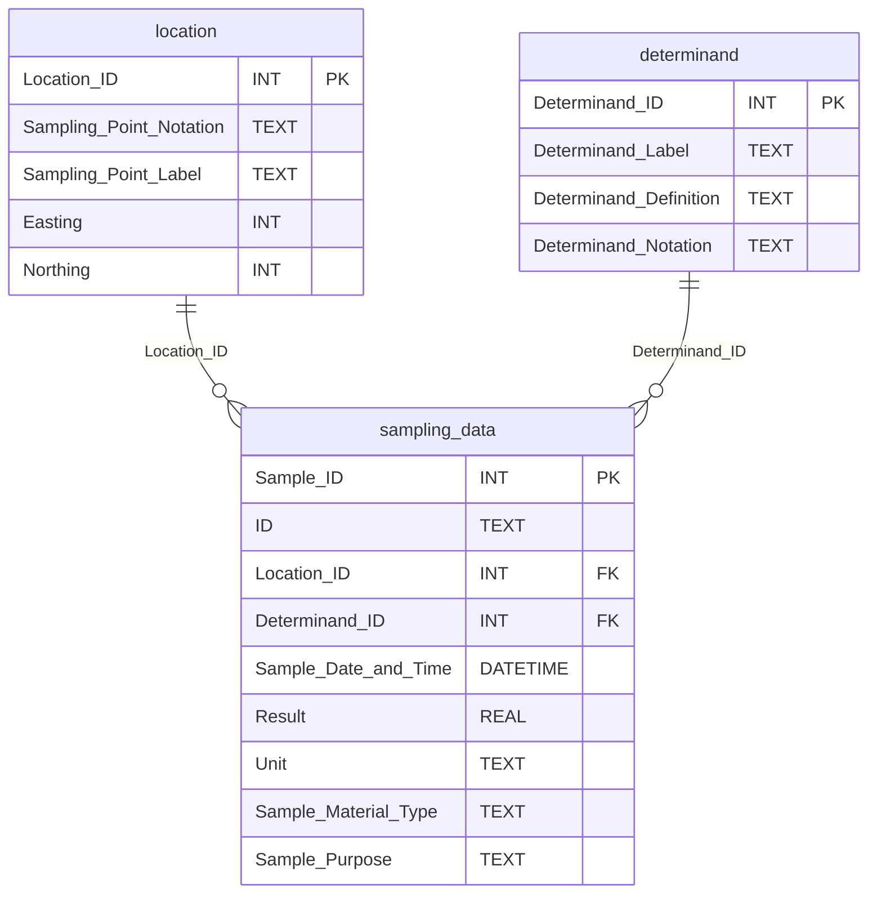

```mermaid
erDiagram
    location {
        Location_ID INT PK
        Sampling_Point_Notation TEXT
        Sampling_Point_Label TEXT
        Easting INT
        Northing INT
    }

    determinand {
        Determinand_ID INT PK
        Determinand_Label TEXT
        Determinand_Definition TEXT
        Determinand_Notation TEXT
    }

    sampling_data {
        Sample_ID INT PK
        ID TEXT
        Location_ID INT FK
        Determinand_ID INT FK
        Sample_Date_and_Time DATETIME
        Result REAL
        Unit TEXT
        Sample_Material_Type TEXT
        Sample_Purpose TEXT
    }

    location ||--o{ sampling_data : "Location_ID"
    determinand ||--o{ sampling_data : "Determinand_ID"

```

