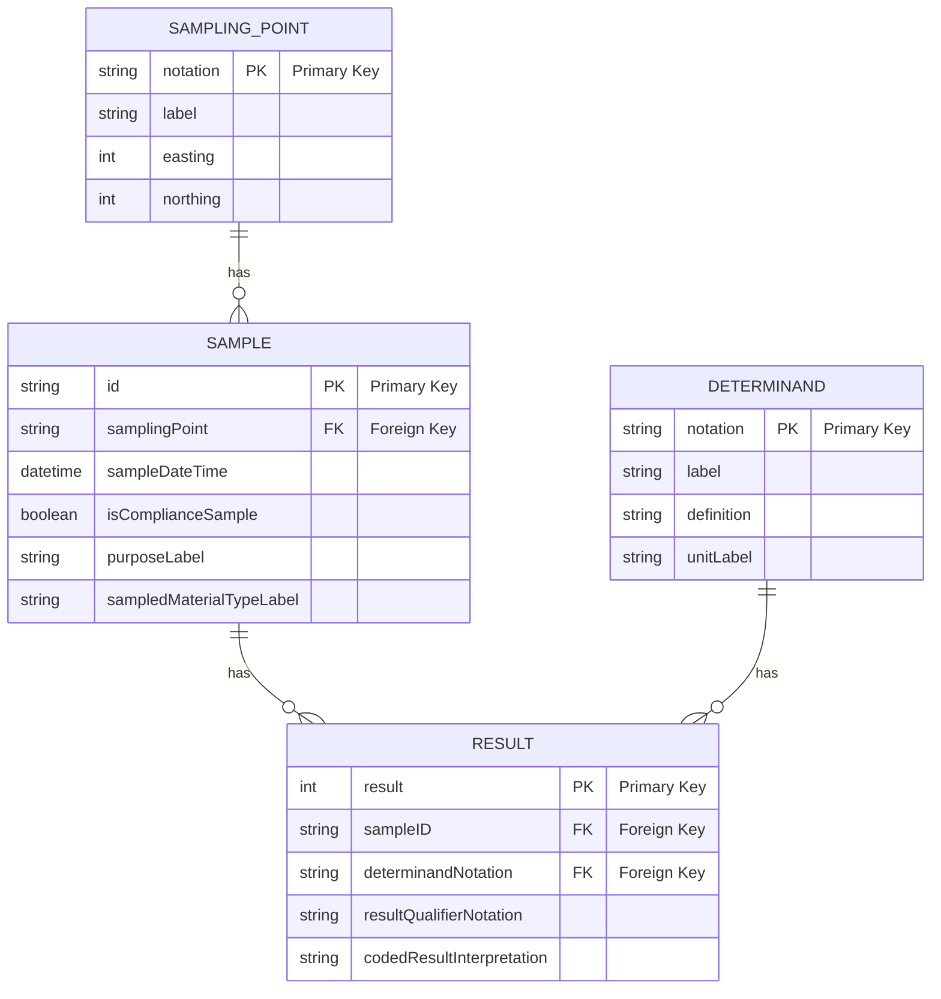

[[ER Diagrams]]

Step 1. Ask Chatgpt to make er diagram with mermaidcode.

Step 2. Use  https://mermaid.js.org/

![[GMMC_er_diagram.png|500]]

Or use obsidians built in feature:

```mermaid
erDiagram
    SAMPLING_POINT {
        string notation PK "Primary Key"
        string label
        int easting
        int northing
    }
    
    SAMPLE {
        string id PK "Primary Key"
        string samplingPoint FK "Foreign Key"
        datetime sampleDateTime
        boolean isComplianceSample
        string purposeLabel
        string sampledMaterialTypeLabel
    }
    
    DETERMINAND {
        string notation PK "Primary Key"
        string label
        string definition
        string unitLabel
    }
    
    RESULT {
        int result PK "Primary Key"
        string sampleID FK "Foreign Key"
        string determinandNotation FK "Foreign Key"
        string resultQualifierNotation
        string codedResultInterpretation
    }
    
    SAMPLING_POINT ||--o{ SAMPLE : "has"
    SAMPLE ||--o{ RESULT : "has"
    DETERMINAND ||--o{ RESULT : "has"
```